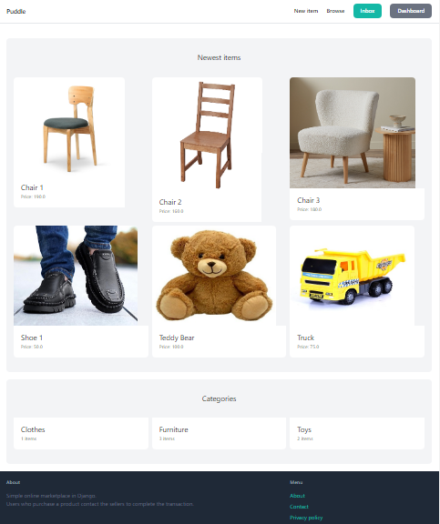
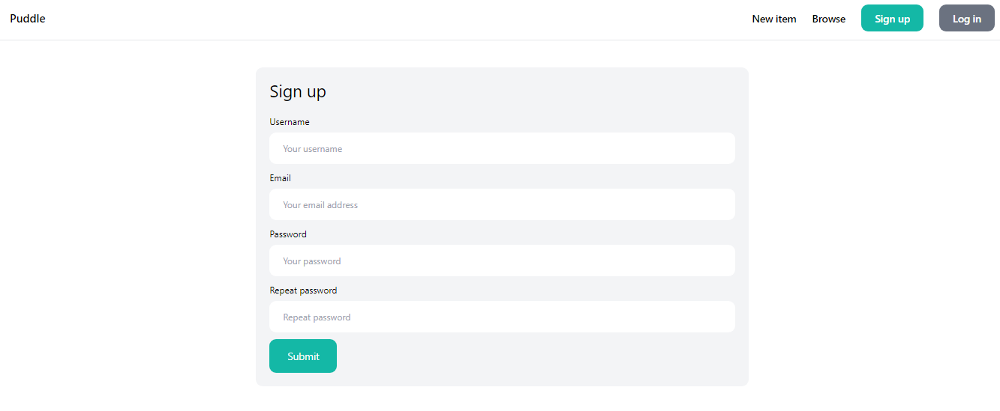
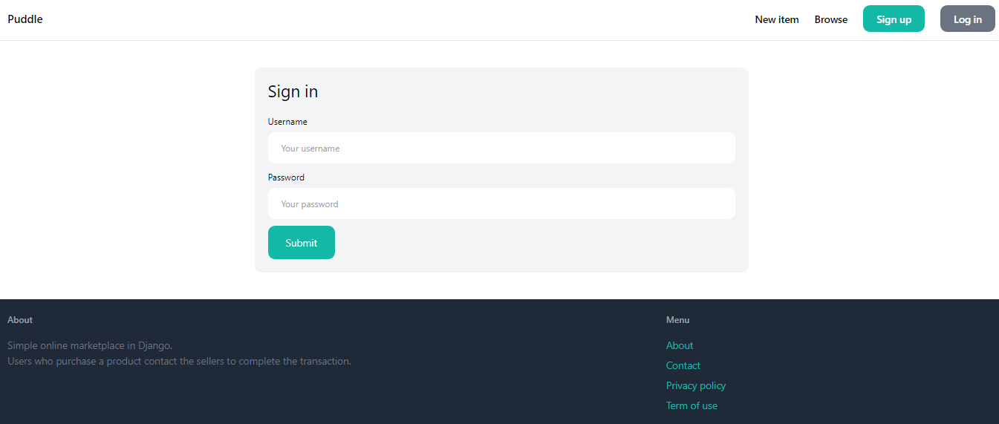
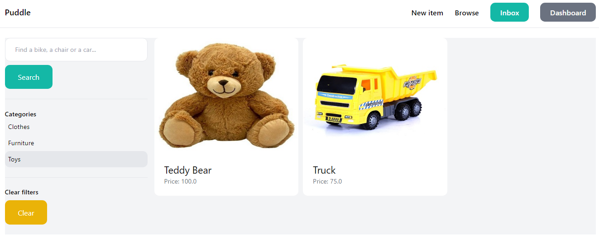
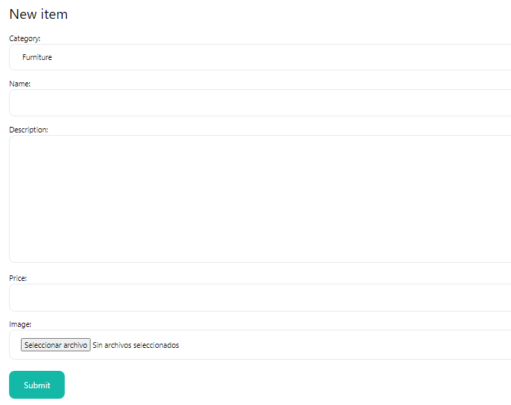
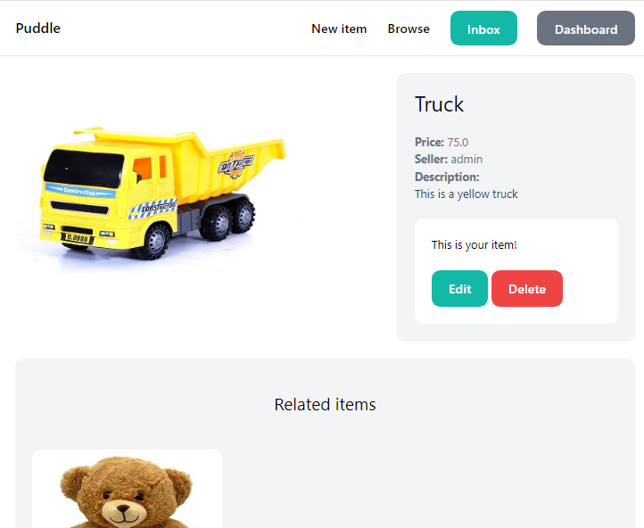
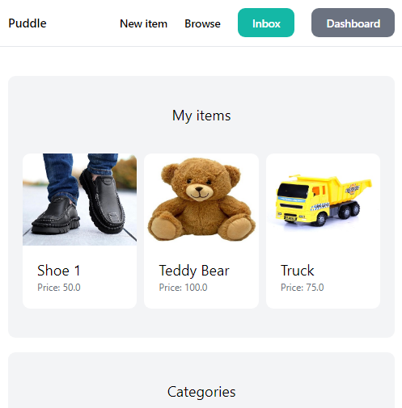
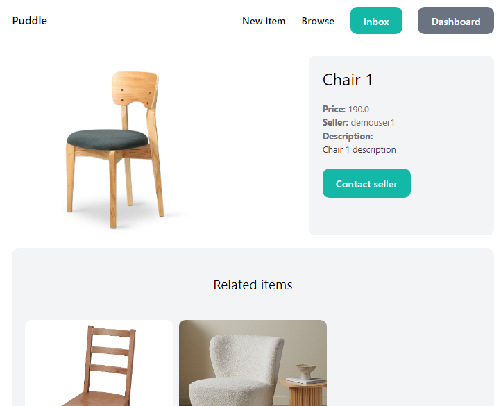
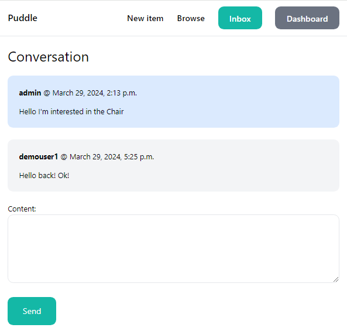
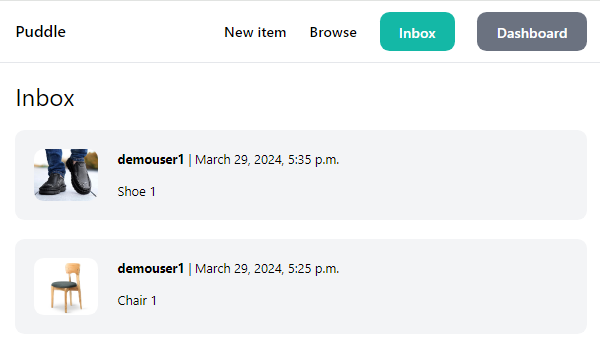

# Django Simple Marketplace

## Description
This is a simple online marketplace in Django.
Users can register, upload their products, edit or delete them. Also can see their items on their dashboard.
They can search for products by name or category. They can also contact the seller and establish a conversation to close the transaction. All their conversations are in the Inbox menu.

## Marketplace options

1. Home:

    In the home page you can see the new items, and their categories:

    

2. Sign up:

    You can create your user:

    

3. Login:

    You can log in with your user:

    

4. Browse items:

    You can search for items by name, description or category:

    

5. New item:

    You can create your items from the New item menu:

    

6. Edit or Delete items:

    You can edit or delete your items:

    

7. Dashboard:
    
    You can view all your items in this menu:

    

8. Contact Seller:

    You can contact the seller of the item you are interested in:

    

9. Conversation:

    You can send a message to the seller of an item you are interested in, or to a buyer of one of your items:

    

10. Inbox:
    
    You can view all your conversations:

    